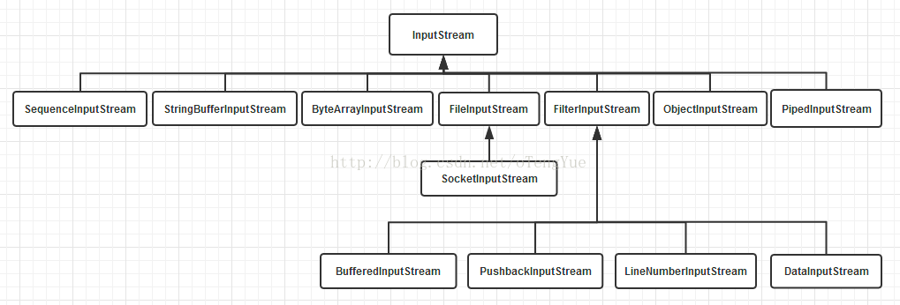
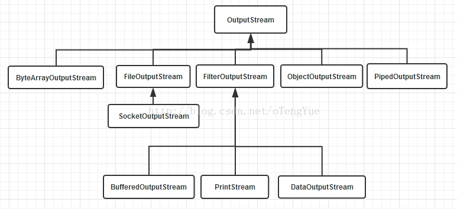
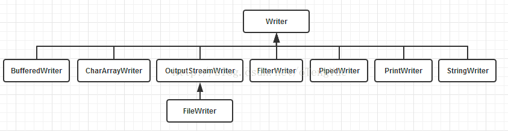
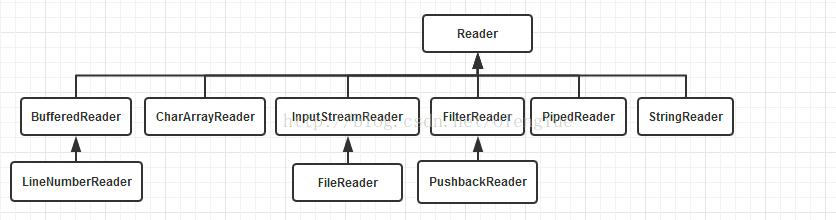

I/O流操作

基于字节操作的 I/O 接口： InputStream 和 OutputStream

InputStream                           抽象类，描述流的输入
OutputStream                       抽象类，描述流的输入
DataInputStream                   包含了读取Java标准数据类型的输入流
DataOutputStream               包含了写Java标准数据类型的输出流
ByteArrayInputStream         从字节数组读取的输入流
ByteArrayOutputStream     写入字节数组的输出流
FileInputStream                     从文件读入的输入流
FileOutputStream                  写入文件的输出流
PrintStream                             包含最常见的Print（）和Println（）的输出流
PushbackInputStream         返回一个字节到输入流，主要用于编译器的实现
PipedInputStream                 输出管道
PipedOutputStream             输入管道
SequenceInputStream       将n个输入流联合起来，一个接一个按一定顺序读取
RandomAccessFile             随机访问文件
BufferInputStream                缓冲输入流
BufferOutputStream            缓冲输出流
FilterInputStream                 实现了InputStream Interface
FilterOutputStream              实现了OutputStream Interface
LineNumberInputStream    过时的实现，建议使用LineNumberReader

基于字符操作的 I/O 接口： Writer 和 Reader
同样处理字符的基类 Writer 和 Reader， 这两个类是抽象类，只是提供了一系列用于字符流处理的接口，不能生成这两个类的实例，
只能通过使用由它们派生出来的子类对象来处理字符流。另外 不管是磁盘还是网络传输，最小的存储单元都是字节，而不是字符，所以 I/O 操作的都是字节而不是字符，但是为啥有操作字符的 I/O 接口呢？
这是因为我们的程序中通常操作的数据都是以字符形式，为了操作方便当然要提供一个直接写字符的 I/O 接口。
注： java.io.Reader和java.io.Writer支持Unicode标准字符集(Character Set)(字节流则只支持ISO-Latin-1 8-bit)。在处理流数据时，会根据系统默认的字符编码来进行字符转换

Writer                                                         所有的输出字符流的父类，它是一个抽象类。
CharArrayWriter、StringWriter         两种基本的介质流，它们分别向Char 数组、String 中写入数据。
PipedWriter                                             是向与其它线程共用的管道中写入数据，
BufferedWriter                                        一个装饰器为Writer 提供缓冲功能。
PrintWriter                                               格式化输出
OutputStreamWriter                             是OutputStream 到Writer 转换的桥梁，它的子类FileWriter 其实就是一个实现此功能的具体类。

Reader                                                     所有的输入字符流的父类，它是一个抽象类。
CharReader、StringReader             两种基本的介质流，它们分别将Char 数组、String中读取数据。
PipedReader                                          是从与其它线程共用的管道中读取数据。
BufferedReader                                     是一个装饰器，它和其子类负责装饰其它Reader 对象。
FilterReader                                           是所有自定义具体装饰流的父类，其子类PushbackReader 对Reader 对象进行装饰，会增加一个行号。
InputStreamReader                              是一个连接字节流和字符流的桥梁，它将字节流转变为字符流

基于磁盘操作的 I/O 接口： File和RandomAccessFile

 File类是对文件系统中文件以及文件夹进行封装的对象，可以通过对象的思想来操作文件和文件夹。 File类保存文件或目录的各种元数据信息，
 包括文件名、文件长度、最后修改时间、是否可读、获取当前文件的路径名，判断指定文件是否存在、获得当前目录中的文件列表，创建、删除文件和目录等方法。
 
RandomAccessFile类 并不是流体系中的一员，其封装了字节流，同时还封装了一个缓冲区（字符数组），通过内部的指针来操作字符数组中的数据。 该对象特点：     
    (1) 该对象只能操作文件，所以构造函数接收两种类型的参数：a.字符串文件路径；b.File对象。
    (2)该对象既可以对文件进行读操作，也能进行写操作，在进行对象实例化时可指定操作模式(r,rw)
    注：该对象在实例化时，如果要操作的文件不存在，会自动创建；如果文件存在，写数据未指定位置，会从头开始写，即覆盖原有的内容。 可以用于多线程下载或多个线程同时写数据到文件

基于网络操作的 I/O 接口： Socket

