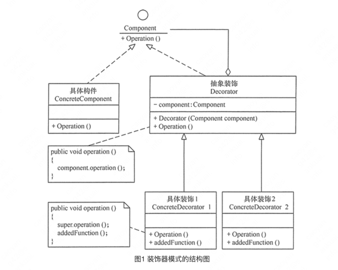
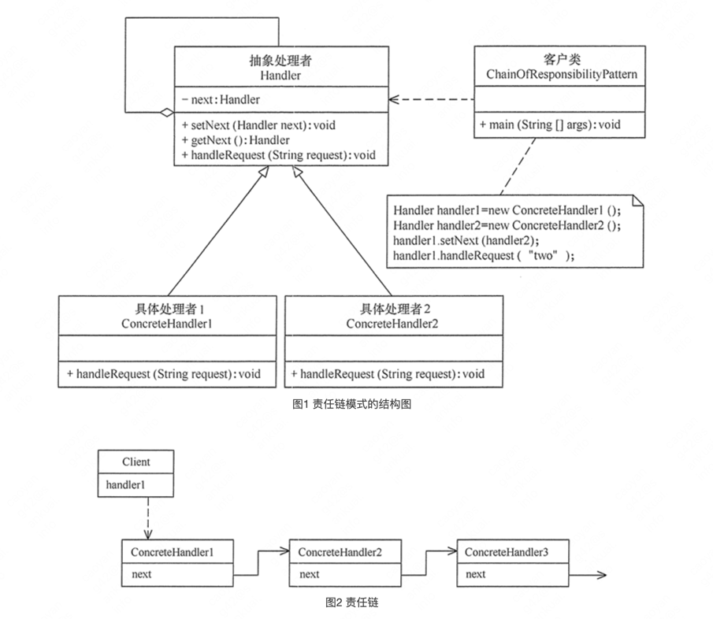
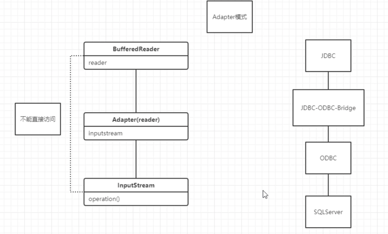
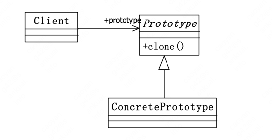
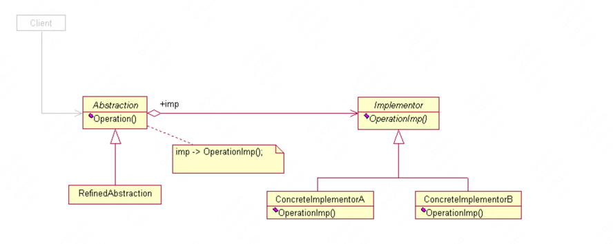
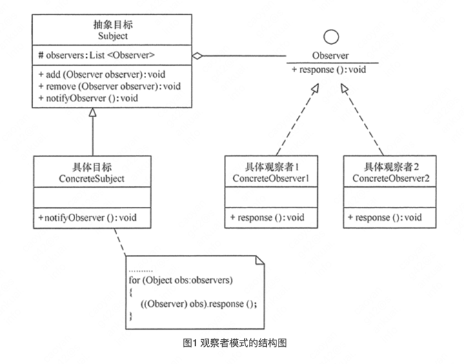
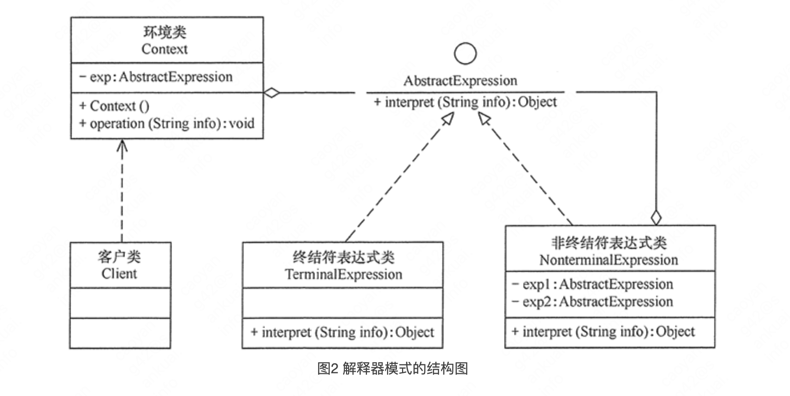

设计模式

1、单例模式

2、策略模式

3、工厂模式

4、装饰器模式

5、代理模式

6、责任链模式

7、迭代器模式

8、访问者模式

9、建造者模式

10、适配器模式

11、命令模式

12、原型模式

13、模板方法模式

14、状态模式

15、门面模式

16、桥接模式

17、观察者模式

18、终结者模式

19、解释器模式

七大设计原则

1、单一职责原则：应该有且仅有一个原因引起类的变更

    类的复杂性降低，实现什么职责都有清晰明确的定义;
    可读性提高，复杂性降低，那当然可读性提高了;
    可维护性提高，那当然了，可读性提高，那当然更容易维护了;
    对于单一职责原则，接口一定要做到单一职责，类设计尽量只有一个原因引起变化。

2、里氏替换原则：加强程序的健壮性，同时版本升级也可以做到非常好的兼容性，增加子类，原有的子类还可以继续运行

    子类必须完全的实现父类的方法
    子类可以有自己的个性
    覆盖或实现父类的方法时输入参数可以被放大
    覆盖或实现父类的方法是输出结果可以被缩小

3、接口隔离原则：对接口进行规范约束
    
    接口尽量要小
    接口要高内聚：接口要高内聚。什么是高内聚?高内聚就是提高接口、类、模块的处理能力，减少对外的交互
    
4、迪米特法则：只和朋友交流

    过度使用迪米特法则会使系统产生大量的中介类，从而增加系统的复杂性，使模块之间的通信效率降低。
    所以，在釆用迪米特法则时需要反复权衡，确保高内聚和低耦合的同时，保证系统的结构清晰。
    所以，在运用迪米特法则时要注意以下 6 点。
    在类的划分上，应该创建弱耦合的类。类与类之间的耦合越弱，就越有利于实现可复用的目标。
    在类的结构设计上，尽量降低类成员的访问权限。
    在类的设计上，优先考虑将一个类设置成不变类。
    在对其他类的引用上，将引用其他对象的次数降到最低。
    不暴露类的属性成员，而应该提供相应的访问器（set 和 get 方法）。
    谨慎使用序列化（Serializable）功能。

5、开闭原则：对扩展开放，对修改关闭

6、依赖倒置原则：高层模块不应该依赖低层模块，两者都应该依赖其抽象；抽象不应该依赖细节，细节应该依赖抽象

    要面向接口编程，不要面向实现编程

7、合成复用原则

