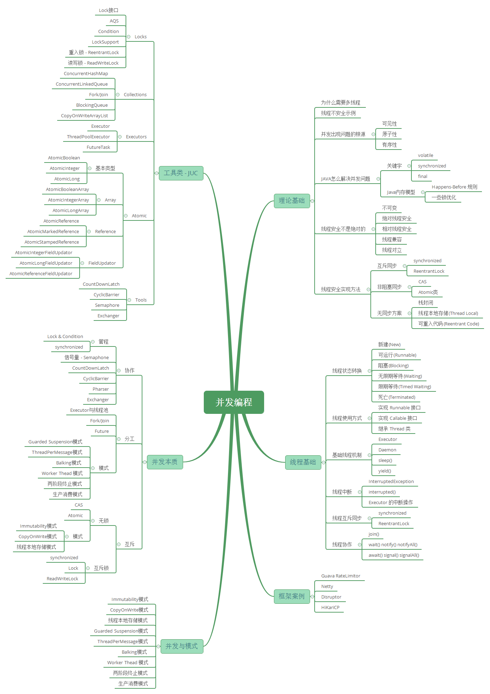
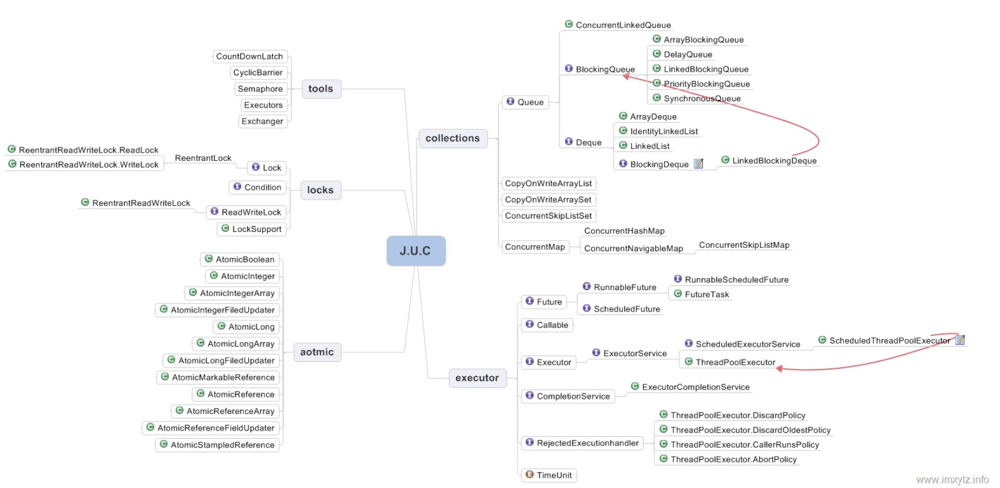
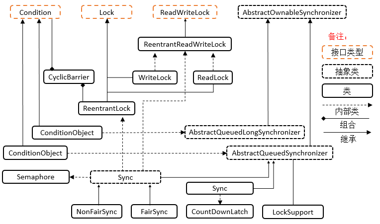
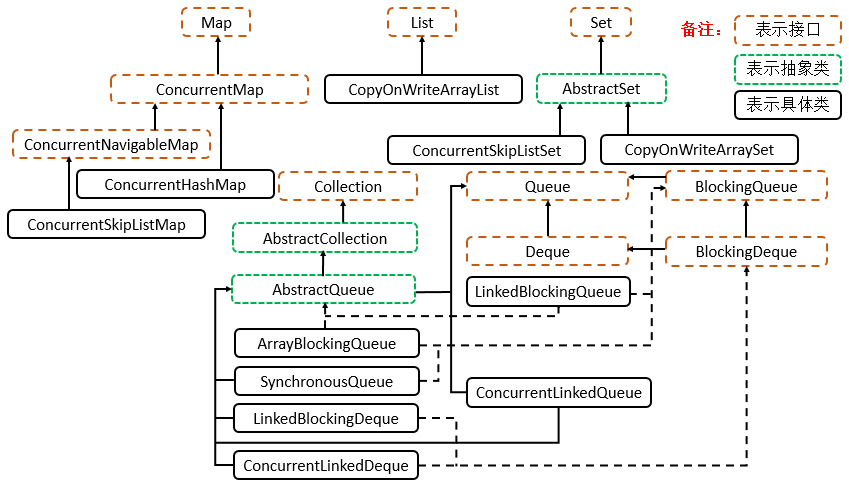
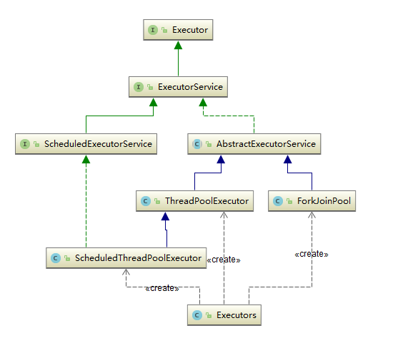
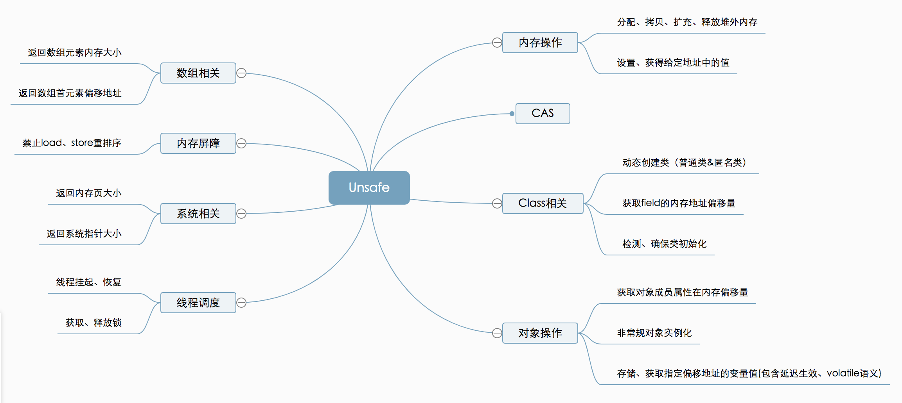
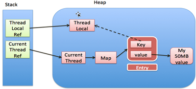

高并发

https://www.pdai.tech/md/java/thread/java-thread-x-juc-overview.html
1. Lock框架和Tools类
   
2. Collections: 并发集合
   
3. Atomic: 原子类
4. Executors: 线程池
   
5. Unsafe
   
   Unsafe本质上提供了3种CAS方法：compareAndSwapObject、compareAndSwapInt和compareAndSwapLong
6. threadLocal 内存泄漏示意图
   