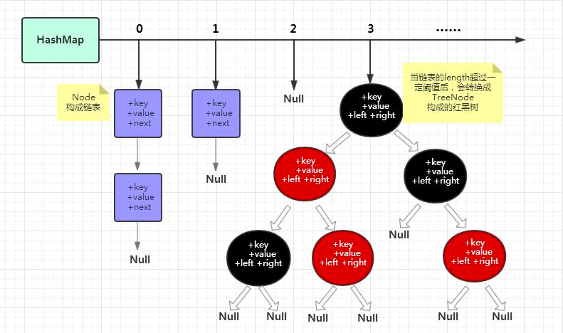
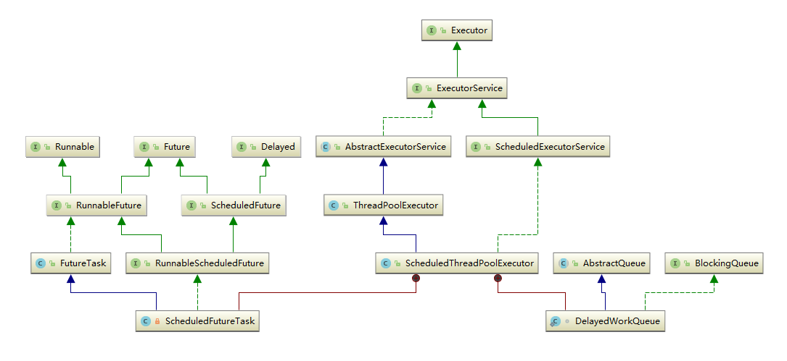
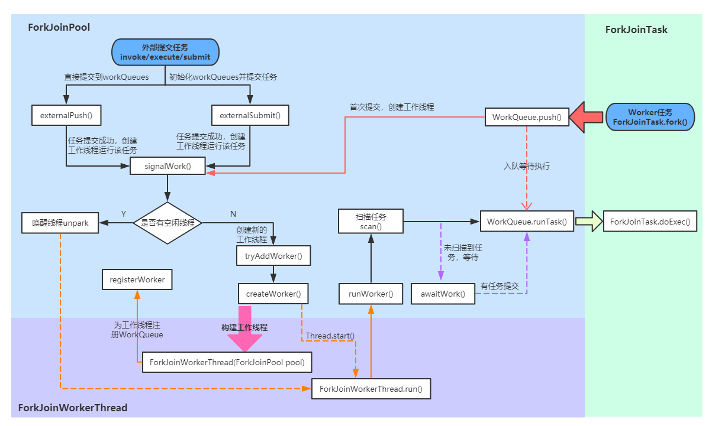
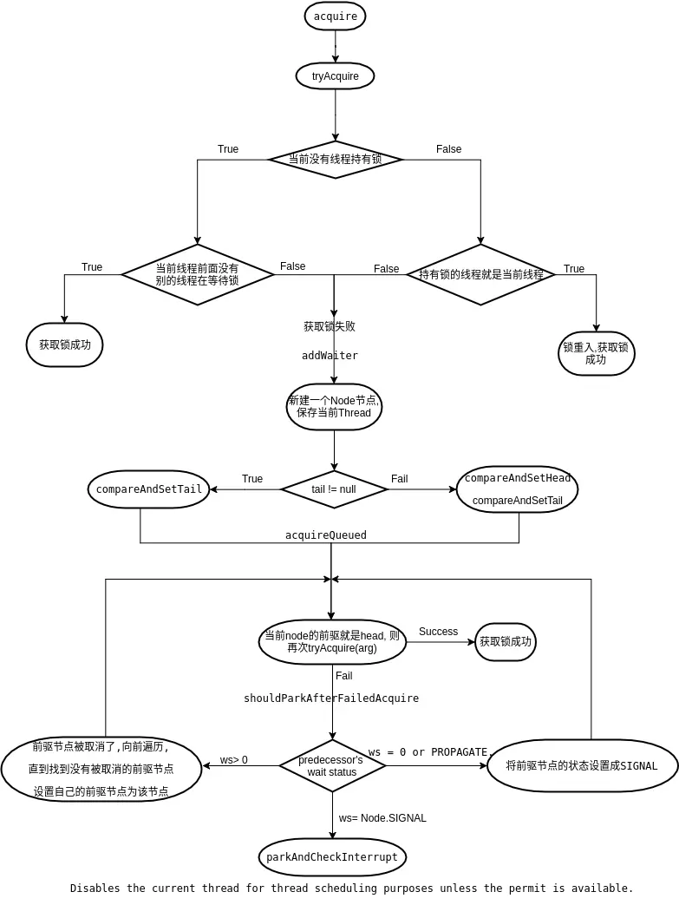

高并发

https://www.pdai.tech/md/java/thread/java-thread-x-juc-overview.html
1. Lock框架和Tools类
   
   1. Collections: 并发集合
      
      
2. Atomic: 原子类
3. Executors: 线程池
   
   
   
4. Unsafe
   
   Unsafe本质上提供了3种CAS方法：compareAndSwapObject、compareAndSwapInt和compareAndSwapLong
5. threadLocal 内存泄漏示意图
   
6. aqs 获取锁流程
   